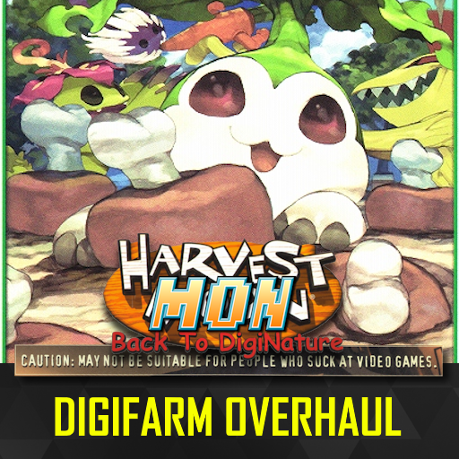
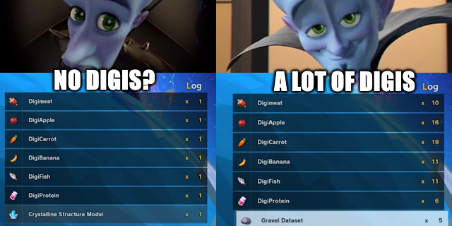
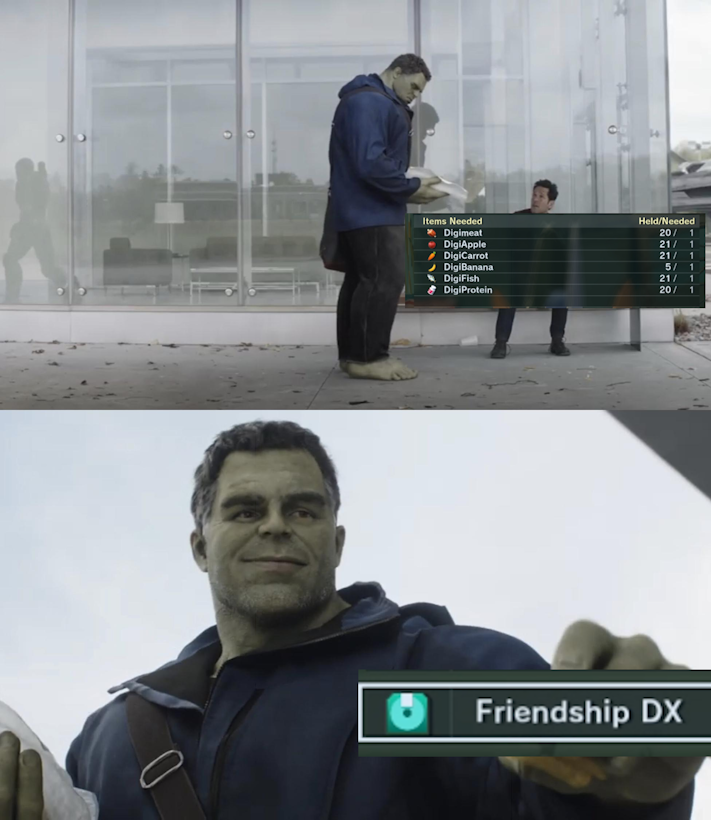
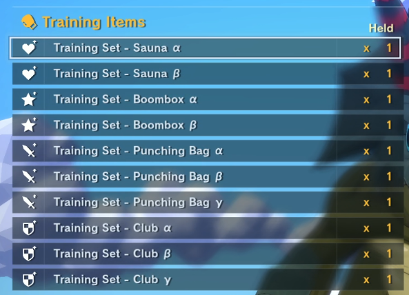
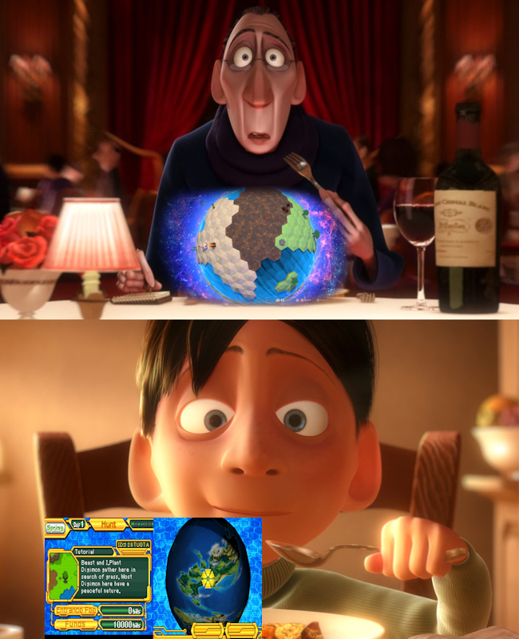
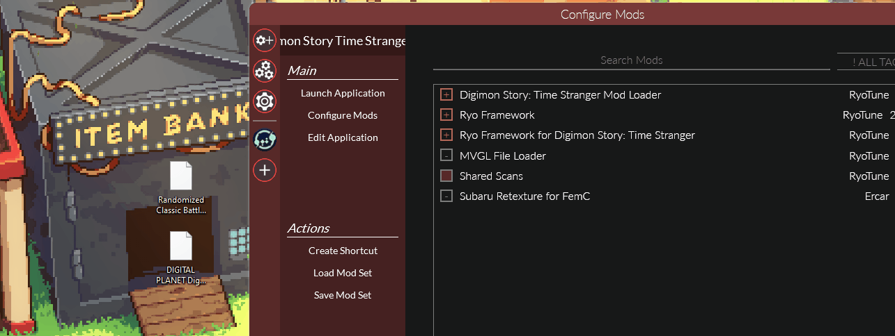

**Do your part and vote for [Digimon World GOG Dreamlist](https://www.gog.com/dreamlist/game/digimon-world-1999) to preserve literally the best game of all time on PC!**

-----

## **Overview: Your Farm is More Than Just a Gym!**

Ever felt the DigiFarm was a bit... barren? Wishing you could do more with it than just train your Digimon? What if your farm could actually *farm* and become a bustling hub for your entire team?

**Harvest Mon: Back to DigiNature** is a complete overhaul of the DigiFarm system in *Digimon Story: Time Stranger*. This mod transforms the farm into a center of passive resource generation, quality-of-life improvements, and introduced expanded crafting, making it an essential and rewarding part of your Digimon-raising journey.

Make your Digimon work for their keep and be rewarded for it!

### **Core Features**

#### **1. A Living, Productive DigiFarm**
Your DigiFarm is no longer just a passive training ground. It now lives up to its name by passively generating valuable **DigiFood**!

*   **Passive Food Generation:** The farm will now automatically produce various types of DigiFood over time. The more Digimon you have on the farm, the better the yields!

#### **2. Quality of Life Crafting & Bonding**
I've streamlined the bonding process and expanded your crafting capabilities to make managing your team easier and more rewarding.

*   **Friendship DX Conversion:** Got a pile of assorted DigiFood? Convert them into **Friendship DX** at Zudomon's shop for a massive, efficient boost to friendship!
*   **New Crafting & Breakdown Recipes:** Zudomon's shop is now stocked with tons of new recipes. Craft powerful curatives and attachments, or break down unwanted items into useful materials.
*   **Progressive Unlocks:** Your crafting capabilities grow alongside your adventure! New recipes become available at Zudomon's shop as you advance through the main story.

#### **3. Clearer Training & Better Aesthetics**
I've polished the DigiFarm training icons to make it more intuitive and visually diverse.

*   **Upgraded Naming Scheme:** Training sets now use a clear, tiered naming system with Greek letters (Alpha, Beta, etc.) to instantly communicate their effectiveness.
*   **New Icons:** Enjoy new, distinct icons for training equipment, adding more visual flair and clarity to the stats the training equipment specializes in.

#### **4. Optional Soundtrack Addons**
Enhance the DigiFarm vibe with an optional soundtrack replacer. Swap out the default music for new tracks to make your farm vibe more with you. This will randomize the music in the DigiFarm! You can toggle them on/off with the reloaded-ii configuration.

### ⚠️ Compatibility Warning
Heads up! This mod directly edits game data, so it won't play nice with other mods that touch the same files (like shop data).

Specifically, it is **NOT** compatible with [Better Shop](https://www.nexusmods.com/digimonstorytimestranger/mods/21) out of the box. If you're feeling adventurous, you can try using the [MBE Mod Merger](https://www.nexusmods.com/digimonstorytimestranger/mods/61) to combine them, but your mileage may vary.

---

## **Installation**

1.  **Download** the mod's **zipped file (no need to extract it)**.
2.  **Install the Mod:** **Drag and drop** the **zipped file** directly onto the main **Reloaded II application** window.
3.  **Enable and Prioritize:** In the *Digimon Story Time Stranger* mod list, click the status indicator (**- icon**) to **enable** the mod (it will turn into a **+ icon**). Then, **drag the mod** to the **top of the list** to ensure correct priority (match the GIF order).
4.  **Launch the Game:** Click **Launch Application** in Reloaded II.
5.  **Enjoy:** Its time to farm! You gotta grow your meat on the farm man!

-----

### **Credits**

* **[RyoTune](https://gamebanana.com/members/2986979)** for the awesome **[ModLoader](https://gamebanana.com/mods/624424)**
* **[Bitsoft](https://next.nexusmods.com/profile/btsoft2?gameId=8213)** for the discovery of the adding items into the shop lineup.
* **[SlimeDoll](https://next.nexusmods.com/profile/SlimeDoll?gameId=8213)** for extensive testing
* **[zeak6464](https://twitter.com/Zeak6464)** for pinpointing me where to look for DigiFarms
* **[Myself](https://next.nexusmods.com/profile/Dodowingster)** for being the absolute goat. The fucking madlad. 